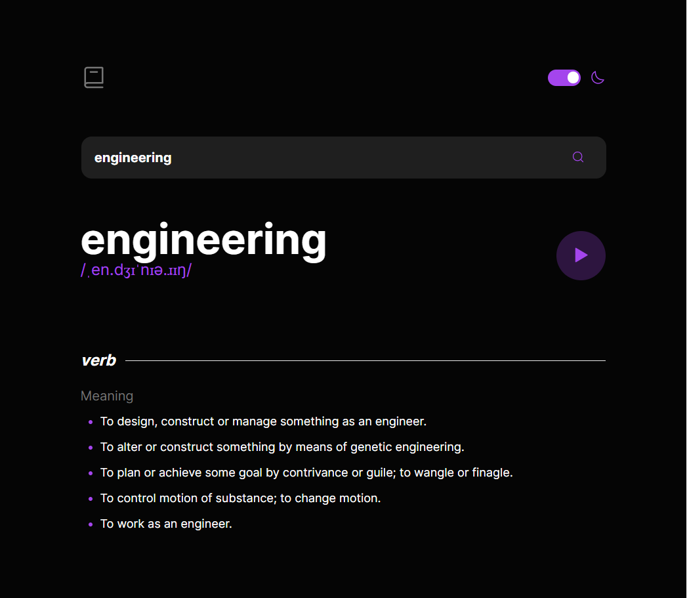

# Frontend Mentor - In-browser markdown editor solution

This is a solution to the [In-browser markdown editor challenge on Frontend Mentor](https://www.frontendmentor.io/challenges/inbrowser-markdown-editor-r16TrrQX9). Frontend Mentor challenges help you improve your coding skills by building realistic projects.

## Table of contents

- [Overview](#overview)
  - [The challenge](#the-challenge)
  - [Screenshot](#screenshot)
  - [Links](#links)
- [My process](#my-process)
  - [Built with](#built-with)
  - [Continued development](#continued-development)
  - [Useful resources](#useful-resources)
- [Author](#author)

## Overview

### The challenge

Users should be able to:

- Search for words using the input field
- See the Free Dictionary API's response for the searched word
- See a form validation message when trying to submit a blank form
- Play the audio file for a word when it's available
- Switch between serif, sans serif, and monospace fonts
- Switch between light and dark themes
- View the optimal layout for the interface depending on their device's screen size
- See hover and focus states for all interactive elements on the page
- **Bonus**: Have the correct color scheme chosen for them based on their computer preferences. _Hint_: Research `prefers-color-scheme` in CSS.

### Screenshot

## Run Project Locally

In the project directory, you can run:

### `npm install`

to download dependencies.

### `npm run start`

Runs the app in the development mode.\
Open [http://localhost:3000](http://localhost:3000) to view it in your browser.

### Links

- Solution URL: [https://github.com/mvrquix/markdown-editor](https://github.com/mvrquix/markdown-editor)
- Live Site URL: [https://isaqc-dictionary.web.app/](https://isaqc-dictionary.web.app/)

## My process

### Built with

- Flexbox
- Desktop-first workflow
- [React](https://reactjs.org/) - JS library
- [SASS](https://www.npmjs.com/package/sass) - For styles
- [Axios](https://www.npmjs.com/package/axios) - For API requests

### Continued development

The next step to this project would be to create a server application to persist data with endpoints for the frontend to network with. With that in place
it would make sense to centralize state management on the frontend in a redux store.

### Useful resources

- [W3Schools](https://www.w3schools.com/howto/howto_css_switch.asp) - This helped me implement the theme switch button.

## Author

- Website - [Marquis Morrow](https://isaqc.io/)
- Frontend Mentor - [@mvrquix](https://www.frontendmentor.io/profile/mvrquix)
- Linkedin - [@marquismorrow](https://www.linkedin.com/in/marquismorrow/)
